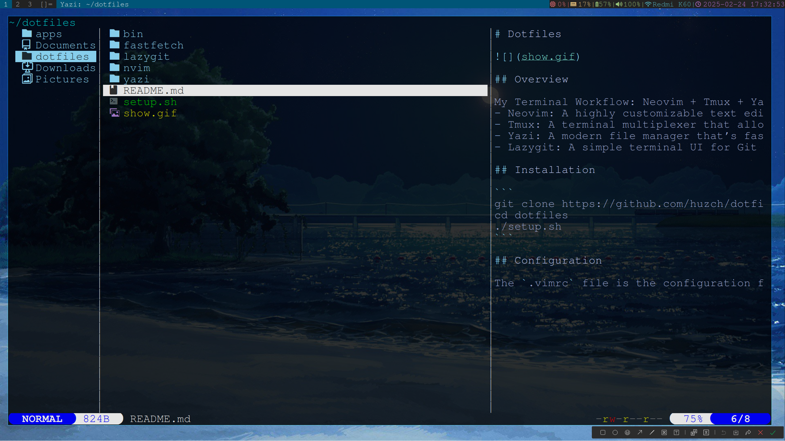
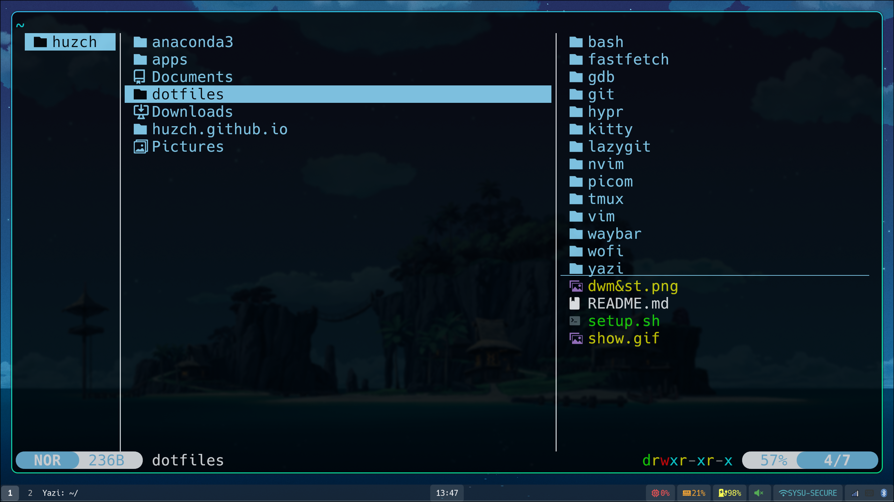
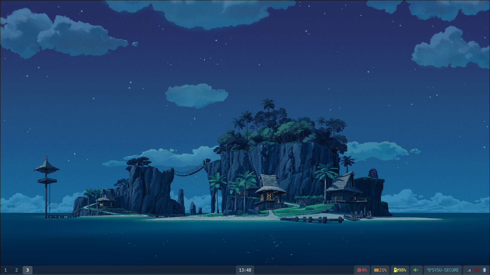

# Dotfiles
dwm(xorg):




hyprland(wayland):





## Overview

My Terminal Workflow: Neovim + Tmux + Yazi + Lazygit
- Neovim: A highly customizable text editor, perfect for coding and editing files
- Tmux: A terminal multiplexer that allows you to manage multiple terminal sessions in a single window
- Yazi: A modern file manager that’s fast and minimal
- Lazygit: A simple terminal UI for Git

## Installation

```
git clone https://github.com/huzch/dotfiles.git
cd dotfiles
./setup.sh
```

## Configuration

The `.vimrc` file is the configuration for vim I used to use, but now I use neovim with `nvim` configuration folder. And I learned this configuration file framework from [The Missing Semester of Your CS Education](https://missing.csail.mit.edu/) that is a series of MIT public courses which is useful, helpful and highly recommended.
